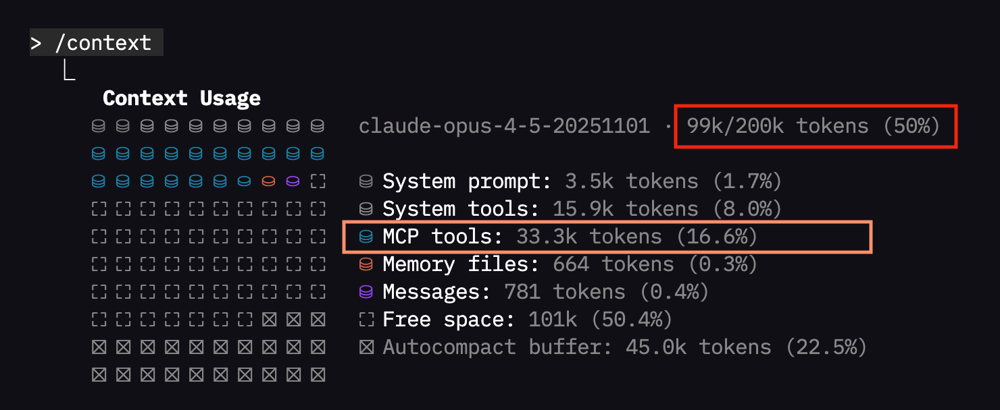
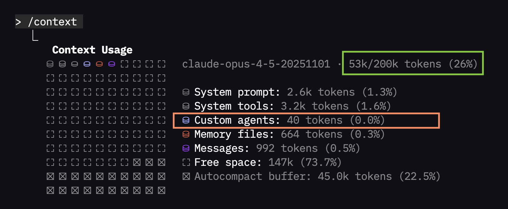

# Cookbooks: Building Context-Efficient Agents

> **[Read the full writeup →](https://tool.store/blog/building-context-efficient-agents)**

This directory contains examples demonstrating how to build context-efficient AI agents using tool-cli. We showcase two implementations—one with Claude Code and one with LangChain—both illustrating the same core concept: **code execution mode**.

## The Problem: MCP Context Bloat

When an MCP host connects to servers, it loads JSON schemas for every tool—parameter names, types, descriptions, nested definitions, output formats. This happens before any conversation starts.

Connect five or six MCP servers and you've burned through tens of thousands of tokens before your user asks a question. As Anthropic's engineering team noted, some agents were processing "hundreds of thousands of tokens before reading a request."

That's not just expensive. It's wasteful. All those tokens eat into the space your agent could use for actual reasoning.

## The Solution: Code Execution Mode

Instead of preloading every tool definition into context, give the agent the ability to write code that discovers and calls tools on demand. The agent explores what's available, loads only what it needs, and executes operations without shuttling data through its context window.

This approach was pioneered by both [Anthropic](https://www.anthropic.com/engineering/code-execution-with-mcp) and [Cloudflare](https://blog.cloudflare.com/code-mode/). As Cloudflare put it: "LLMs are better at writing code to call MCP, than at calling MCP directly."

### The Bash Way

While Anthropic and Cloudflare use TypeScript, tool-cli takes a different approach: **bash**.

Bash ships with virtually every Linux distribution, every macOS machine, and every Docker container. No runtime to install, no transpilation step. The agent writes a script, the shell executes it directly.

tool-cli turns MCP servers into command-line programs:

```bash
tool call open-data-mcp -m get_current_weather -p latitude=35.68 -p longitude=139.76 --json
```

Bash scripts can chain these calls together without coming back to the model:

```bash
bash -c 'COORDS=$(tool call open-data-mcp -m geocode -p address="Paris" --concise --json); \
LAT=$(echo "$COORDS" | jq -r ".latitude"); \
LON=$(echo "$COORDS" | jq -r ".longitude"); \
tool call open-data-mcp -m get_current_weather -p latitude="$LAT" -p longitude="$LON" --concise --json'
```

One bash execution. Two tool calls. The intermediate result never becomes part of the conversation history.

### Three Operations

In code mode, agents use three operations:

1. **Search** (`tool grep`) - Find relevant tools by keyword
2. **Info** (`tool info`) - Get the schema for specific methods
3. **Call** (`tool call`) - Execute tool methods

The `--concise` flag minimizes token usage in outputs.

## Results

We ran the same task through two agent configurations:
- **Normal Agent**: MCP tools preloaded the traditional way
- **Code Mode Agent**: Using tool-cli for on-demand discovery

Task: `"Find the movie 'The Vast of Night' and tell me about its director"`

Both got it right. But look at the context usage:

| Normal Agent (MCP tools preloaded) | Code Mode Agent (tool-cli) |
|:----------------------------------:|:--------------------------:|
|  |  |

After completing the same task:
- **Normal agent**: 50% of context window (88k tokens)
- **Code mode agent**: 26% of context window (42k tokens)

That's **46k fewer tokens** for the same result—a 52% reduction.

The difference comes from MCP tool schemas. The normal agent loaded 33.3k tokens of schemas upfront (51 tool definitions). The code mode agent loaded zero upfront, paying only for the 2 methods it actually used.

---

## Examples

### Claude Code Agent

```sh
cd cookbooks/claude-code
```

Install the open-data-mcp tool:

```sh
tool install ../mcps/open_data_mcp
```

**Normal Agent** - Add open-data-mcp to Claude host and run:

```sh
tool host add cc open-data-mcp -y && claude --agent normal-agent --dangerously-skip-permissions "Find the movie \"The Vast of Night\" and tell me about its director"
```

Use `/context` in Claude to observe token usage.

**Code Mode Agent** - Remove open-data-mcp from Claude host and run:

```sh
tool host remove cc open-data-mcp -y && claude --agent code-mode-agent --dangerously-skip-permissions "Find the movie \"The Vast of Night\" and tell me about its director"
```

Use `/context` to compare token usage with the normal agent.

### LangChain Agent

```sh
cd cookbooks/langchain
```

Install the open-data-mcp tool:

```sh
tool install ../mcps/open_data_mcp
```

Set your API key:

```sh
export ANTHROPIC_API_KEY=sk-ant...
```

**Normal Agent** - Run with open-data-mcp and bash-mcp loaded:

```sh
uv run --directory agent/ agent.py "Find the movie \"The Vast of Night\" and tell me about its director"
```

Observe the token usage in the output.

**Code Mode Agent** - Run with `--code` flag (only bash tool loaded):

```sh
uv run --directory agent/ agent.py "Find the movie \"The Vast of Night\" and tell me about its director" --code
```

Compare the token usage with the normal agent run.

---

## When to Use Code Mode

Code mode shines when:
- You have many MCP servers connected
- Conversations run for extended sessions
- You need to chain complex workflows
- Context window efficiency matters for cost or capability

For simple use cases with few tools and short conversations, traditional MCP setup works fine.

## Security Considerations

You're running bash commands generated by an AI model. Use proper isolation:
- Run in containers when possible
- Limit file system access
- Consider what happens if the model writes a malformed or unintended command

## References

- [Code Execution with MCP](https://www.anthropic.com/engineering/code-execution-with-mcp) - Anthropic
- [Code Mode](https://blog.cloudflare.com/code-mode/) - Cloudflare
- [Model Context Protocol](https://modelcontextprotocol.io/docs/getting-started/intro)
